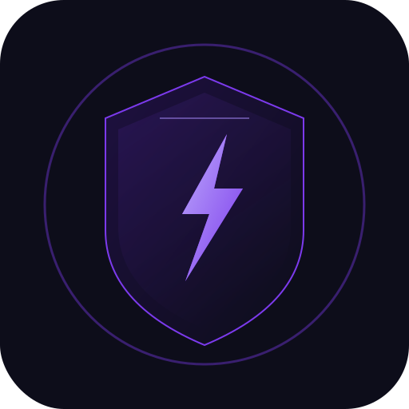

  

<h1 align="center">Elevate Sports</h1>

  <strong>CRM Deportivo Inteligente</strong> 
  La herramienta de mando para clubes deportivos

  
  
  

---

## El Problema

Los clubes deportivos juveniles en Latinoamerica gestionan sus operaciones con hojas de calculo, grupos de WhatsApp y memoria. No existe una herramienta accesible que integre lo deportivo con lo administrativo de forma profesional.

## La Solucion

Elevate Sports unifica entrenamiento, tactica, calendario, finanzas y rendimiento de atletas en una sola plataforma con estetica premium, experiencia offline-first y algoritmos de ciencia deportiva.

---

## Plataforma

| Capacidad | Descripcion |
|-----------|-------------|
| Gestion de plantilla | Registro de atletas, stats, fotos, bulk import |
| Pizarra tactica | Campo interactivo con drag & drop, formaciones, herramientas de dibujo |
| Entrenamiento | Sesiones RPE, planificacion, export PDF, historial completo |
| Match Center | Ingesta post-partido, scoring inteligente, player cards, analytics |
| Calendario + RSVP | Eventos, confirmacion de asistencia, recordatorios WhatsApp |
| Finanzas | Control de pagos, morosidad, movimientos, semaforo financiero |
| Motor de salud | Algoritmo RPE con alertas automaticas de riesgo y sobrecarga |
| Rendimiento | Elevate Score (0-10), recomendaciones tacticas, spider charts |

## Caracteristicas Tecnicas

- Aplicacion web progresiva (PWA) — instalable en cualquier dispositivo
- Funciona offline — sincroniza automaticamente al recuperar conexion
- Multi-tenancy — datos aislados por club con seguridad a nivel de fila
- Cumplimiento Ley 1581 (Habeas Data Colombia) para datos de menores
- Estetica gaming/consola inspirada en FIFA/EA Sports FC

---

## Propiedad Intelectual

Este software es propiedad exclusiva de **Elevate Sports Holding**.
Todos los derechos reservados. Uso no autorizado prohibido.

Algoritmos deportivos, logica de negocio, diseño visual y arquitectura de datos son activos protegidos de la empresa.

---

  <strong>Elevate Sports</strong> &mdash; Tecnologia deportiva que eleva el rendimiento

