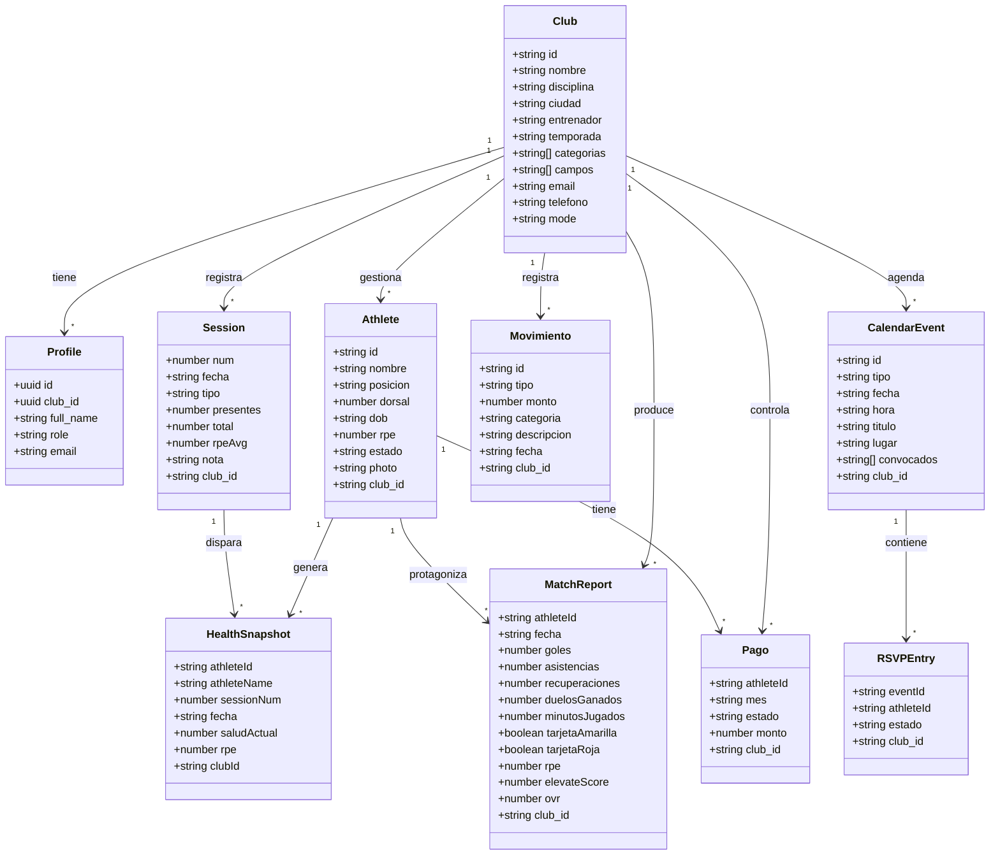
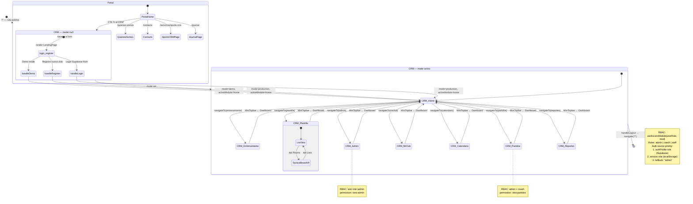
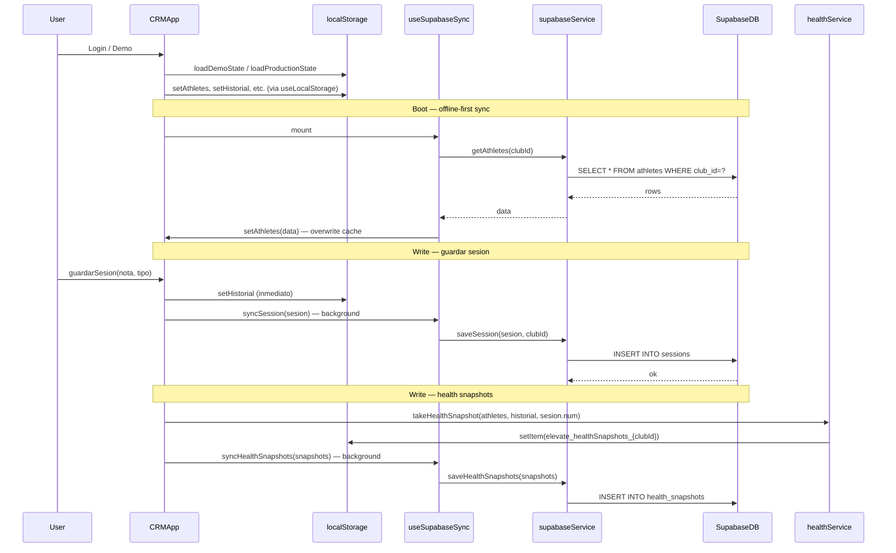

# Elevate Sports — Arquitectura del Sistema (2026-03-29)

> Diagrama generado por @Carlos (Arquitecto) a partir del código fuente real.
> Última revisión: 2026-03-29. Fuente de verdad: rama `desarrollo`.

---

## 1. Diagrama de Componentes

```mermaid
graph TD
  %% ── Entry Point ──────────────────────────────────────────────────────────
  subgraph entry["Entry Point"]
    main["main.jsx"]
    regSW["registerSW.js\n(PWA bridge)"]
  end

  %% ── PWA / Build ──────────────────────────────────────────────────────────
  subgraph build["Build & PWA — vite.config.js"]
    vPWA["vite-plugin-pwa\n(Workbox)"]
    SW["Service Worker\nsw.js\nCacheFirst / NetworkFirst\nBackgroundSync"]
  end

  %% ── Root ──────────────────────────────────────────────────────────────────
  subgraph appRoot["App.jsx — BrowserRouter"]
    AppRoot["App()\nBrowserRouter + Routes"]
    CRMApp["CRMApp()\nState machine\nactiveModule • athletes • historial\nclubInfo • matchStats • finanzas\nmode • session • authProfile"]
  end

  %% ── Portal (rutas públicas) ───────────────────────────────────────────────
  subgraph portal["Portal Corporativo — lazy loaded (/)"]
    PortalLayout["PortalLayout\nNavbar glassmorphism + Outlet\nRoute: /"]
    PortalHome["PortalHome (index)"]
    HeroSection["HeroSection"]
    EcoSection["EcosystemSection"]
    ServicesSection["ServicesSection"]
    JournalSection["JournalSection"]
    QuienesSomos["QuienesSomos\n/quienes-somos"]
    Contacto["Contacto\n/contacto"]
    SportsCRMPage["SportsCRMPage\n/servicios/sports-crm"]
    JournalPage["JournalPage\n/journal"]
    PrivacyPolicy["PrivacyPolicy\n/privacidad"]
  end

  %% ── CRM módulos ──────────────────────────────────────────────────────────
  subgraph crm["CRM App — lazy loaded (/crm/*)"]
    LandingPage["LandingPage\nlogin + register\n← sin mode"]
    Home["Home\nDashboard FIFA\nKPIs clickeables\nProximo Evento real"]
    Entrenamiento["Entrenamiento\nRPE engine\nAsistencia + sesiones"]
    GestionPlantilla["GestionPlantilla\nLista FIFA + Pizarra táctica\nBulkAthleteUploader"]
    Administracion["Administracion\nPagos · Movimientos · Resumen"]
    MiClub["MiClub\nConfig del club"]
    Calendario["Calendario\nVista mensual + RSVP"]
    MatchCenter["MatchCenter\nPost-partido · Player Card Pro\nElevateScore · Spider SVG"]
    Reportes["Reportes\n(inline en App.jsx)"]
  end

  %% ── TacticalBoard V9 subsystem ───────────────────────────────────────────
  subgraph tbv9["TacticalBoard V9 — subsistema"]
    TBV9["TacticalBoardV9\nv9.1 landscape 105x68\nfull/half pitch toggle"]
    FieldLayer["FieldLayer\nLayer 1 — SVG pitch\nforwardRef • memo"]
    DrawingLayer["DrawingLayer\nLayer 3 — SVG vectors\nflechas · presión · corte"]
    GhostToken["GhostToken\nDrag ghost\nring buffer trail 3 sombras\n60fps sin re-renders"]
    DrawingToolbar["DrawingToolbar\nBottom bar\npanel expandible AnimatePresence"]
    Planificacion["Planificacion\nsub-component de Entrenamiento"]
    BulkUploader["BulkAthleteUploader\nCSV / XLSX onboarding"]
  end

  %% ── UI Primitives ────────────────────────────────────────────────────────
  subgraph uiPrim["UI Primitives — src/components/ui/"]
    EmptyState["EmptyState"]
    OfflineBanner["OfflineBanner"]
    UpdateToast["UpdateToast"]
    InstallBanner["InstallAppBanner"]
    ImportIcons["ImportIcons"]
  end

  subgraph sharedComps["Shared Components — src/components/"]
    ErrorBoundary["ErrorBoundary"]
    Toast["Toast / ToastContainer"]
    FieldBg["FieldBackground"]
    ConfirmModal["ConfirmModal"]
    LegalDisclaimer["LegalDisclaimer"]
    MiniTopbar["MiniTopbar (inline CRMApp)"]
  end

  %% ── Hooks ────────────────────────────────────────────────────────────────
  subgraph hooks["Hooks — src/hooks/"]
    useLS["useLocalStorage\nsyncs state ↔ localStorage\nerror handler injectable"]
    useSBSync["useSupabaseSync\nwrite-through pattern\noffline-first"]
    useDrag["useDragEngine\nlong-press 150ms\npointer events\nsnap to nearest token"]
    useDraw["useDrawingEngine\nSVG drawing state\ncoords porcentuales 0-100\nlocalStorage persist"]
    useResp["useResponsive\nbreakpoints xs/sm/md/lg\ndebounced 150ms"]
    useInstall["useInstallPWA\nbeforeinstallprompt\niOS detect\n7-day dismiss"]
  end

  %% ── Services ─────────────────────────────────────────────────────────────
  subgraph services["Services — src/services/"]
    sbSvc["supabaseService\nwrite-through cache\ncreateClub · getClub\nsaveAthletes · saveSession\nmigrateLocalToSupabase"]
    authSvc["authService\nsignUp · signIn · signOut\ngetProfile · onAuthStateChange\nlinkProfileToClub"]
    healthSvc["healthService\ntakeHealthSnapshot\ngetSnapshots · clearSnapshots\nsetHealthClubId (multi-tenancy)"]
    storageSvc["storageService\nloadDemoState · loadProductionState\nlogout · calcStats · buildSesion"]
    migSvc["migrationService\nrunMigrations\nschema versioning"]
    backupSvc["backupService\nexportBackupJSON"]
    bulkSvc["bulkUploadService\nCSV/XLSX parse"]
  end

  %% ── Lib ──────────────────────────────────────────────────────────────────
  subgraph lib["Lib — src/lib/"]
    sbClient["supabase.js\ncreateClient\nisSupabaseReady flag"]
    regSWLib["registerSW.js\nSW lifecycle bridge"]
  end

  %% ── Utils ────────────────────────────────────────────────────────────────
  subgraph utils["Utils — src/utils/"]
    rpe["rpeEngine\ncalcSaludActual\ncalcCargaSemanal\nsaludColor · tendenciaSalud"]
    score["elevateScore\ncalcElevateScore\ncalcOVR\ngetPerformanceAlert\ngenerateRecommendations\ngetAthleteScoreHistory"]
    helpers["helpers\ngetAvatarUrl (DiceBear)\ncalculateAge\ngetStatusStyle"]
    sanitize["sanitize (DOMPurify)\nsanitizeText (onChange)\nsanitizeNote\nsanitizeTextFinal (submit)"]
  end

  %% ── Constants ────────────────────────────────────────────────────────────
  subgraph constants["Constants — src/constants/"]
    palette["palette.js\nPALETTE\nneon · purple · bg · surface…"]
    roles["roles.js\nROLES (admin/coach/staff)\nhasPermission · canAccessModule\nSESSION_KEY · createSession"]
    schemas["schemas.js\nZod schemas\ncreateMovimiento · validatePago\nvalidateSesion"]
    initStates["initialStates.js\nEMPTY_ATHLETES\nEMPTY_HISTORIAL\nEMPTY_MATCH_STATS\nEMPTY_FINANZAS"]
  end

  %% ── Supabase (external) ──────────────────────────────────────────────────
  subgraph supabase["Supabase BaaS"]
    sbDB[("PostgreSQL + RLS\nclubs · profiles\nathletes · sessions\nhealth_snapshots\npagos · movimientos\nmatch_reports\ncalendar_events · rsvp")]
    sbAuth["Auth\nemail/password\ntrigger → profiles"]
  end

  %% ═══ EDGES — Entry ═══
  main --> AppRoot
  main --> regSW
  regSW --> SW

  %% ═══ EDGES — App Root ═══
  AppRoot -->|"Route /"| PortalLayout
  AppRoot -->|"Route /crm/*"| CRMApp
  AppRoot -->|"Route /privacidad"| PrivacyPolicy

  %% ═══ EDGES — Portal ═══
  PortalLayout --> PortalHome
  PortalLayout --> QuienesSomos
  PortalLayout --> Contacto
  PortalLayout --> SportsCRMPage
  PortalLayout --> JournalPage
  PortalLayout -.-> OfflineBanner
  PortalLayout -.-> UpdateToast
  PortalLayout -.-> InstallBanner
  PortalLayout -.-> useResp
  PortalHome --> HeroSection
  PortalHome --> EcoSection
  PortalHome --> ServicesSection
  PortalHome --> JournalSection

  %% ═══ EDGES — CRM ═══
  CRMApp -->|"!mode"| LandingPage
  CRMApp -->|"home"| Home
  CRMApp -->|"entrenamiento"| Entrenamiento
  CRMApp -->|"plantilla"| GestionPlantilla
  CRMApp -->|"admin"| Administracion
  CRMApp -->|"miclub"| MiClub
  CRMApp -->|"calendario"| Calendario
  CRMApp -->|"partidos"| MatchCenter
  CRMApp -->|"reportes"| Reportes
  CRMApp -.-> ErrorBoundary
  CRMApp -.-> MiniTopbar
  CRMApp -.-> FieldBg
  CRMApp -.-> OfflineBanner
  CRMApp -.-> UpdateToast

  %% CRMApp hooks
  CRMApp -.-> useLS
  CRMApp -.-> useSBSync
  CRMApp -.-> authSvc
  CRMApp -.-> storageSvc
  CRMApp -.-> healthSvc
  CRMApp -.-> backupSvc
  CRMApp -.-> sbSvc
  CRMApp -.-> roles
  CRMApp -.-> initStates
  CRMApp -.-> schemas
  CRMApp -.-> palette

  %% ═══ EDGES — GestionPlantilla ═══
  GestionPlantilla --> TBV9
  GestionPlantilla --> BulkUploader

  %% ═══ EDGES — TacticalBoard V9 ═══
  TBV9 --> FieldLayer
  TBV9 --> DrawingLayer
  TBV9 --> GhostToken
  TBV9 --> DrawingToolbar
  TBV9 -.-> useDrag
  TBV9 -.-> useDraw
  TBV9 -.-> useLS
  TBV9 -.-> rpe
  TBV9 -.-> helpers

  %% ═══ EDGES — Entrenamiento ═══
  Entrenamiento --> Planificacion
  Entrenamiento -.-> rpe
  Entrenamiento -.-> sanitize
  Entrenamiento -.-> helpers

  %% ═══ EDGES — MatchCenter ═══
  MatchCenter -.-> score

  %% ═══ EDGES — Administracion ═══
  Administracion -.-> schemas
  Administracion -.-> ConfirmModal

  %% ═══ EDGES — MiClub ═══
  MiClub -.-> sanitize

  %% ═══ EDGES — Home ═══
  Home -.-> useResp
  Home -.-> EmptyState

  %% ═══ EDGES — Hooks ═══
  useSBSync --> sbSvc
  useSBSync --> sbClient
  useDraw -.-> useLS
  healthSvc -.-> rpe

  %% ═══ EDGES — Services → Lib/External ═══
  sbSvc --> sbClient
  authSvc --> sbClient
  sbClient --> sbDB
  sbClient --> sbAuth
```

---

## 2. Diagrama de Entidades de Datos (Data Model simplificado)

---

## 3. Máquina de Estados — Navegación CRMApp

---

## 4. Flujo de Datos — Offline-First + Supabase Sync

---

## Resumen del Stack

| Capa | Tecnología | Versión |
|------|-----------|---------|
| Framework | React | 19 |
| Bundler | Vite | 8 |
| Animaciones | Framer Motion | 12 |
| Router | React Router DOM | 6 |
| Backend/Auth/DB | Supabase | latest |
| PWA | vite-plugin-pwa + Workbox | latest |
| Sanitización | DOMPurify | latest |
| Validación | Zod | latest |
| Deploy | Vercel | auto-deploy desde master |

## RBAC — Permisos por Rol

| Permiso | admin | coach | staff |
|---------|-------|-------|-------|
| view:home | SI | SI | SI |
| view:entrenamiento | SI | SI | SI |
| view:plantilla | SI | SI | NO |
| view:admin | SI | NO | NO |
| view:miclub | SI | NO | NO |
| view:reportes | SI | SI | NO |
| view:calendario | SI | SI | NO |
| view:partidos | SI | SI | NO |
| edit:athletes | SI | SI | NO |
| edit:sesion | SI | SI | SI |
| edit:finanzas | SI | NO | NO |
| edit:tactical | SI | SI | NO |
| export:backup | SI | NO | NO |
| manage:roles | SI | NO | NO |
