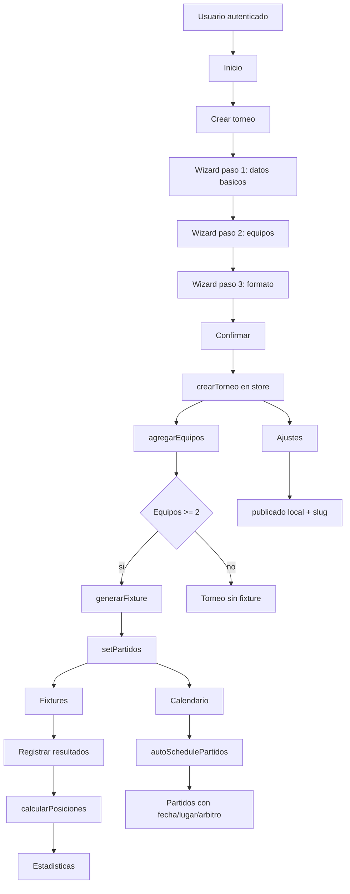
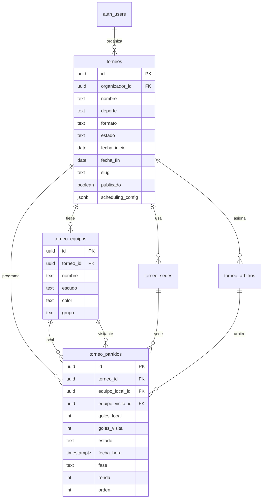

# Auditoria del modulo Torneos

Fecha: 2026-05-06  
Alcance: `src/app/torneos` y dependencias compartidas usadas directamente.  
Reglas aplicadas: solo documentacion; no se modifico codigo, no se modifico la base de datos, no se ejecutaron migraciones y no se hizo commit.

## 1. Resumen ejecutivo

El modulo Torneos existe como una aplicacion React independiente bajo `/torneos/*`, con autenticacion por Supabase Auth, layout propio, store Zustand persistido en localStorage y pantallas para crear torneos, gestionar equipos, generar fixtures, programar calendario, registrar resultados, ver estadisticas y publicar una URL conceptual.

El estado funcional actual es bueno para demo local o prototipo comercial, pero no esta listo para un cliente real multiusuario:

- La fuente de verdad real es `localStorage` mediante `src/app/torneos/store/useTorneosStore.js`.
- La integracion Supabase de datos de torneos existe solo como servicio aislado en `src/app/torneos/services/torneosService.js`.
- Ese servicio no esta importado por las paginas ni por el store.
- Las tablas que el servicio espera (`torneos`, `torneo_equipos`, `torneo_partidos`) no existen en `docs/supabase-schema-actual.sql` ni en `supabase/migrations`.
- No hay ruta publica real `/t/:slug` declarada en `src/App.jsx`; `AjustesPage.jsx` genera una URL publica conceptual.
- No hay modelo de tenant para Torneos: el comentario del servicio habla de `organizador_id`, pero `saveTorneo()` no lo persiste.

Conclusion: Torneos es hoy un modulo frontend-local funcional para demostracion. Antes de seguir agregando features, se debe versionar su modelo de datos, definir multi-tenancy/RLS, integrar persistencia remota o declarar explicitamente que sigue siendo prototipo local.

## 2. Estado actual del modulo

Entrada:

- `src/App.jsx` monta `TorneosApp` en `/torneos/*`.
- `src/app/torneos/TorneosApp.jsx` controla auth, layout y navegacion interna por estado local `activeModule`.

Capas actuales:

- UI/shell: `TorneosApp.jsx`, `TorneosSidebar.jsx`, `TorneosHeader.jsx`.
- Pantallas: `InicioPage`, `TorneosListPage`, `EquiposPage`, `FixturesPage`, `EstadisticasPage`, `CalendarioPage`, `AjustesPage`.
- Wizard: `CrearTorneoWizard.jsx`.
- Estado: `useTorneosStore.js`.
- Dominio puro: `fixturesEngine.js`, `schedulingEngine.js`.
- Servicio remoto previsto: `torneosService.js`.

El modulo no usa React Router interno para subrutas; usa un `activeModule` en memoria dentro de `TorneosApp.jsx`.

## 3. Mapa de archivos

```text
src/app/torneos/
|-- TorneosApp.jsx
|-- components/
|   |-- shared/
|   |   |-- ModuleEmptyState.jsx
|   |   |-- TorneosHeader.jsx
|   |   `-- TorneosSidebar.jsx
|   `-- wizard/
|       `-- CrearTorneoWizard.jsx
|-- pages/
|   |-- AjustesPage.jsx
|   |-- CalendarioPage.jsx
|   |-- EquiposPage.jsx
|   |-- EstadisticasPage.jsx
|   |-- FixturesPage.jsx
|   |-- InicioPage.jsx
|   `-- TorneosListPage.jsx
|-- services/
|   `-- torneosService.js
|-- store/
|   `-- useTorneosStore.js
`-- utils/
    |-- fixturesEngine.js
    `-- schedulingEngine.js
```

Dependencias compartidas directas:

- `src/shared/lib/supabase.js`: cliente Supabase y `isSupabaseReady`.
- `src/shared/services/authService.js`: `signIn`, `signUp`, `signOut`, `deleteAccount`, `onAuthStateChange`.
- `src/shared/tokens/palette.js`: tokens visuales.
- `lucide-react`: iconografia.
- `framer-motion`: animaciones.
- `zustand` y `zustand/middleware`: store persistente.

## 4. Rutas o pantallas actuales

Ruta externa:

- `/torneos/*`: renderiza `TorneosApp`.

Pantallas internas por `activeModule`:

| `activeModule` | Pantalla | Archivo | Estado |
|---|---|---|---|
| `inicio` | Dashboard/welcome | `pages/InicioPage.jsx` | Funcional local. |
| `crear` | Wizard de creacion | `components/wizard/CrearTorneoWizard.jsx` | Funcional local. |
| `torneos` | Lista de torneos | `pages/TorneosListPage.jsx` | Funcional local. |
| `equipos` | Gestion de equipos | `pages/EquiposPage.jsx` | Funcional local. |
| `categorias` | Empty state | inline en `TorneosApp.jsx` | Placeholder. |
| `calendario` | Sedes, arbitros y programacion | `pages/CalendarioPage.jsx` | Parcial local. |
| `estadisticas` | Tabla de posiciones | `pages/EstadisticasPage.jsx` | Funcional basico local. |
| `fixtures` | Fixture y resultados | `pages/FixturesPage.jsx` | Parcial local. |
| `publica` | Ajustes/publicacion | `pages/AjustesPage.jsx` | Conceptual local. |
| `ajustes` | Ajustes/publicacion | `pages/AjustesPage.jsx` | Conceptual local. |

Observacion: `publica` y `ajustes` renderizan la misma pagina.

## 5. Componentes principales

- `TorneosApp.jsx`
  - Auth gate.
  - Login/registro inline (`TorneosAuthScreen`).
  - Modal de importacion inline (`ImportModal`).
  - Layout con sidebar/header.
  - Navegacion interna por `activeModule`.

- `TorneosSidebar.jsx`
  - Menu lateral con Inicio, Torneos, Equipos, Categorias, Calendario, Estadisticas, Fixtures, Vista publica y Ajustes.
  - Muestra torneo activo.

- `TorneosHeader.jsx`
  - Header superior.
  - Dropdown de cuenta.
  - Acciones: cerrar sesion y eliminar cuenta.

- `CrearTorneoWizard.jsx`
  - Wizard de 4 pasos: informacion basica, equipos, fases, confirmar.
  - Crea torneo, equipos y fixture inicial.

- `InicioPage.jsx`
  - Welcome cuando no hay torneo activo.
  - Dashboard del torneo activo con checklist, estadisticas y proximo partido.

- `TorneosListPage.jsx`
  - Lista, apertura, seleccion y eliminacion de torneos.

- `EquiposPage.jsx`
  - Alta, edicion, eliminacion y asignacion manual de grupo.

- `FixturesPage.jsx`
  - Genera/regenera fixture.
  - Muestra liga, eliminacion o grupos/playoffs.
  - Registra resultado de partidos con modal.

- `CalendarioPage.jsx`
  - Configura dias, horas, duracion, descanso, maximo por dia.
  - Alta/eliminacion de sedes y arbitros.
  - Programacion automatica y edicion manual de fecha/lugar.

- `EstadisticasPage.jsx`
  - Tabla de posiciones por puntos, diferencia de gol y goles a favor.

- `AjustesPage.jsx`
  - Edita datos basicos.
  - Publica/despublica torneo.
  - Genera URL conceptual `/t/${torneo.slug}`.

## 6. Store actual de Torneos

Archivo: `src/app/torneos/store/useTorneosStore.js`.

Tecnologia:

- Zustand.
- Middleware `persist`.
- Storage key: `alttez-torneos-store`.

Estado persistido:

```js
{
  torneos: [],
  equipos: [],
  partidos: [],
  sedes: [],
  arbitros: [],
  torneoActivoId: null,
  wizardDraft: null
}
```

Entidad `torneo` creada por `crearTorneo(data)`:

- `id`
- `nombre`
- `deporte`
- `formato`
- `estado`
- `fechaInicio`
- `fechaFin`
- `slug`
- `numGrupos`
- `publicado`
- `schedulingConfig`
- `createdAt`
- `updatedAt`

Entidad `equipo`:

- `id`
- `torneoId`
- `nombre`
- `escudo`
- `color`
- `grupo`
- `createdAt`

Entidad `partido` generada por `fixturesEngine.js`:

- `id`
- `torneoId`
- `fase`
- `ronda`
- `grupo`
- `equipoLocalId`
- `equipoVisitaId`
- `golesLocal`
- `golesVisita`
- `estado`
- `fechaHora`
- `lugar`
- `orden`
- `createdAt`
- Puede recibir despues `sedeId` y `arbitroId`.

Acciones principales:

- Torneos: `crearTorneo`, `actualizarTorneo`, `eliminarTorneo`, `setTorneoActivo`, `publicarTorneo`, `actualizarSchedulingConfig`.
- Sedes: `agregarSede`, `eliminarSede`.
- Arbitros: `agregarArbitro`, `eliminarArbitro`.
- Equipos: `agregarEquipo`, `agregarEquipos`, `actualizarEquipo`, `eliminarEquipo`, `asignarGrupo`.
- Partidos: `setPartidos`, `registrarResultado`, `actualizarPartido`, `autoSchedulePartidos`.
- Selectors: `getTorneoById`, `getEquiposByTorneo`, `getPartidosByTorneo`, `getPartidosByFase`, `getPartidosByGrupo`, `getPosicionesByTorneo`, `getSedesByTorneo`, `getArbitrosByTorneo`, `getTorneoActivo`.

## 7. Servicios existentes

Archivo: `src/app/torneos/services/torneosService.js`.

Funciones:

- `saveTorneo(torneo)`: upsert en `torneos`.
- `deleteTorneoRemote(id)`: delete en `torneos`.
- `saveEquipos(torneoId, equipos)`: upsert en `torneo_equipos`.
- `savePartidos(torneoId, partidos)`: upsert en `torneo_partidos`.
- `updateResultado(partidoId, golesLocal, golesVisita)`: update en `torneo_partidos`.
- `getTorneoPublico(slug)`: lee `torneos`, `torneo_equipos`, `torneo_partidos`.

Estado real:

- No se encontraron imports de `torneosService.js` desde `src/app/torneos`.
- Las tablas usadas por el servicio no existen en `docs/supabase-schema-actual.sql`.
- No hay migraciones para esas tablas.
- El comentario dice que el modulo usa `organizador_id`, pero `saveTorneo()` no escribe `organizador_id`.
- No persiste `schedulingConfig`, `sedes`, `arbitros`, ni categorias.

## 8. Utilidades de fixtures, calendario y logica de partidos

`src/app/torneos/utils/fixturesEngine.js`:

- `generarFixture(torneo, equipos)`
  - `todos_contra_todos`: genera liga round-robin.
  - `eliminacion`: genera bracket inicial y rondas posteriores vacias.
  - `grupos_playoffs`: distribuye equipos en grupos, genera liga por grupo y brackets vacios.

- `distribuirEnGrupos(equipos, numGrupos)`
  - Distribucion serpentina.

- `calcularPosiciones(partidos, equipos)`
  - Cuenta PJ, PG, PE, PP, GF, GC, DG, PTS.
  - Ordena por PTS, DG, GF.

Limitaciones:

- No avanza ganadores automaticamente en eliminacion.
- No resuelve desempates avanzados.
- No maneja ida/vuelta.
- No valida duplicidad de equipos.
- En grupos/playoffs, los playoffs quedan vacios y no se llenan con clasificados.

`src/app/torneos/utils/schedulingEngine.js`:

- `autoSchedule({ partidos, sedes, arbitros, torneo })`
  - Crea slots desde `fechaInicio`, dias disponibles, hora inicio/fin y duracion.
  - Respeta `maxPartidosDia`.
  - Intenta respetar descanso por equipo.
  - Asigna sedes y arbitros round-robin.

Limitaciones:

- No bloquea solapamientos de sede/arbitro en el mismo slot.
- No contempla disponibilidad especifica de sedes/arbitros.
- No reporta partidos no programados salvo por conteo indirecto.
- No persiste remotamente.

## 9. Flujo actual de autenticacion

Flujo:

1. `TorneosApp` inicializa `authUser` como `undefined` si Supabase esta listo, o `null` si no esta listo.
2. Si Supabase esta listo, ejecuta `supabase.auth.getUser()`.
3. Se suscribe a `onAuthStateChange`.
4. Si no hay usuario, renderiza `TorneosAuthScreen`.
5. Login usa `signIn(email, password)` de `src/shared/services/authService.js`.
6. Registro usa `signUp({ email, password, fullName, role: "admin" })`.
7. Logout usa `authSignOut()` y navega a `/`.
8. Eliminar cuenta usa `deleteAccount()`.

Riesgos:

- Si Supabase no esta configurado, `authUser` queda `null` y se muestra login, pero `signIn` devolvera "Supabase no disponible"; no hay modo demo local sin auth para Torneos.
- `deleteAccount()` llama RPC `delete_user`, que segun `docs/auditoria-supabase.md` no existe en la base real.
- Auth esta compartida con CRM y crea `profiles` con `role`, pero Torneos no tiene `organizador_id` ni organizacion propia.

## 10. Flujo actual de usuario

1. Usuario entra a `/torneos`.
2. Si hay sesion Supabase, entra al layout; si no, ve login/registro.
3. En `inicio`, si no hay torneo activo, ve welcome y CTA para crear/importar.
4. `Crear torneo` abre `CrearTorneoWizard`.
5. Wizard captura nombre, deporte, fecha, equipos y formato.
6. Al confirmar:
   - `crearTorneo(data)` crea torneo en store.
   - `agregarEquipos(torneo.id, nombres)` crea equipos.
   - si hay al menos 2 equipos, `generarFixture(torneo, equipos)` crea partidos.
   - `setPartidos(torneo.id, partidos)` guarda fixture.
7. Usuario queda en lista de torneos.
8. Puede abrir un torneo y navegar a equipos, fixtures, calendario, estadisticas o ajustes.
9. En fixtures registra resultados.
10. En estadisticas ve tabla calculada.
11. En ajustes puede publicar/despublicar y copiar URL conceptual.

## 11. Flujo actual de datos

```mermaid
flowchart TD
  A[/torneos/*] --> B[TorneosApp]
  B --> C{Supabase Auth}
  C -->|sin usuario| D[TorneosAuthScreen]
  C -->|usuario activo| E[Layout Torneos]
  E --> F[useTorneosStore]
  F --> G[(localStorage alttez-torneos-store)]
  F --> H[fixturesEngine.js]
  F --> I[schedulingEngine.js]
  J[torneosService.js] -. no integrado .-> K[(Supabase: tablas torneos inexistentes)]
```

## 12. Estado de persistencia localStorage

Persistencia real:

- Key: `alttez-torneos-store`.
- Guarda todo el estado del store: torneos, equipos, partidos, sedes, arbitros, torneo activo y wizard draft.
- No hay versionado/migracion de schema local.
- No hay particion por usuario. Si dos cuentas usan el mismo navegador, pueden ver el mismo estado local salvo que se limpie manualmente.
- No hay sync remoto ni reconciliacion.

Datos locales criticos:

- Torneos y su configuracion.
- Equipos.
- Partidos, resultados, fecha/hora/lugar, arbitro.
- Sedes y arbitros.
- Publicacion local (`publicado`) y `slug`.

## 13. Estado de integracion con Supabase

Integracion existente:

- Supabase Auth: activa y usada por `TorneosApp`.
- Supabase DB: servicio existe, pero no integrado.

Tablas que intenta usar `torneosService.js`:

- `torneos`
- `torneo_equipos`
- `torneo_partidos`

Estado segun auditorias previas:

- No existen en `docs/supabase-schema-actual.sql`.
- No existen en `supabase/migrations`.
- No hay RLS.
- No hay `organizador_id` aplicado.
- No hay ruta publica real que consuma `getTorneoPublico(slug)`.

## 14. Funcionalidades completas

Completas para prototipo local:

- Auth gate basico con Supabase Auth.
- Crear torneo desde wizard.
- Agregar equipos en wizard.
- Agregar, editar y eliminar equipos desde pantalla de equipos.
- Seleccionar torneo activo.
- Listar y eliminar torneos.
- Generar fixture para liga todos contra todos.
- Generar bracket base para eliminacion.
- Generar fase de grupos y bracket vacio para grupos/playoffs.
- Registrar resultados de partidos existentes.
- Calcular tabla de posiciones.
- Configurar calendario basico.
- Agregar sedes y arbitros.
- Programar automaticamente partidos con reglas simples.
- Publicar/despublicar localmente.

## 15. Funcionalidades incompletas

Parciales:

- Persistencia Supabase: servicio no integrado y tablas inexistentes.
- Vista publica: se genera URL `/t/:slug`, pero no hay ruta declarada ni pagina publica.
- Importar datos: `ImportModal` muestra input y CTA, pero no procesa archivos.
- Categorias: solo empty state.
- Jugadores/cuerpos tecnicos: la UI menciona gestion de jugadores y cuerpos tecnicos, pero el modelo solo tiene equipos.
- Eliminacion directa: no avanza ganadores a siguientes rondas.
- Grupos + playoffs: no clasifica equipos automaticamente desde tabla a playoffs.
- Calendario: asigna sedes/arbitros, pero no valida conflictos.
- Publicacion: cambia flags locales, no publica en backend.
- Cuenta/eliminar usuario: depende de RPC ausente en DB real.

Faltantes:

- Modelo DB versionado.
- RLS y multi-tenancy.
- Carga inicial desde Supabase.
- Guardado remoto de torneos/equipos/partidos/sedes/arbitros.
- Manejo de errores de sync.
- Migracion de localStorage a Supabase.
- Tests del modulo Torneos.
- Ruta publica real y SEO/lectura anon controlada.
- Auditoria de permisos por rol/organizador.
- Validaciones fuertes de negocio.

## 16. Riesgos tecnicos

1. Datos locales no aislados por usuario.
   - `alttez-torneos-store` no incluye user id en la key.
   - Un usuario puede heredar datos locales de otro en el mismo navegador.

2. Servicio remoto no usado.
   - `torneosService.js` puede dar falsa sensacion de persistencia cloud.

3. Tablas inexistentes.
   - Cualquier integracion directa con `torneosService.js` fallara hoy.

4. Modelo incompleto frente al store.
   - El servicio no cubre `sedes`, `arbitros`, `schedulingConfig` ni categorias.

5. Sin tenant model.
   - No hay `organizador_id`, `organization_id` ni RLS.

6. Logica de eliminacion directa incompleta.
   - Los brackets posteriores no reciben ganadores.

7. Regenerar fixture puede borrar resultados.
   - `setPartidos(torneoId, ps)` reemplaza todos los partidos del torneo.

8. Publicacion no funcional.
   - `AjustesPage` copia `/t/:slug`, pero la app no declara esa ruta.

9. Textos con mojibake.
   - Hay caracteres corruptos en labels/comentarios, por ejemplo `Fútbol`, `Categorías`, `sesión`.

10. Sin pruebas.
   - No se observaron tests dedicados a `fixturesEngine`, `schedulingEngine` o flujos de Torneos.

## 17. Riesgos comerciales

- Un cliente real esperaria persistencia multiusuario; hoy el modulo depende del navegador.
- Una demo puede funcionar, pero los datos no se comparten entre dispositivos.
- La URL publica puede prometer una funcionalidad que no existe.
- La falta de avance automatico de playoffs limita torneos reales.
- Sin RLS, no hay forma segura de operar datos de distintos organizadores.
- Sin modelo de categorias, jugadores o inscripciones, el alcance puede no cubrir torneos complejos.
- El modulo puede generar confianza visual mayor que su madurez tecnica real.

## 18. Partes que dependen de tablas inexistentes

Dependencia directa:

- `src/app/torneos/services/torneosService.js`
  - `torneos`
  - `torneo_equipos`
  - `torneo_partidos`

Dependencia conceptual:

- `AjustesPage.jsx`
  - Genera URL publica `/t/:slug`, pero no existe tabla publica ni ruta.

Dependencia de auth/RPC externa:

- `TorneosHeader.jsx` -> `TorneosApp.jsx` -> `deleteAccount()` -> RPC `delete_user`, ausente en la base real segun `docs/auditoria-supabase.md`.

## 19. Partes que deberian separarse mejor

- `TorneosApp.jsx`
  - Mezcla auth screen, import modal, layout y routing interno. Conviene separar `auth/TorneosAuthScreen.jsx`, `components/import/ImportModal.jsx` y `shell/TorneosShell.jsx`.

- `useTorneosStore.js`
  - Mezcla estado, acciones, selectores y parte de logica de calendario. Conviene separar store local, selectors y repositorio/persistencia.

- `torneosService.js`
  - Debe ser repositorio real o eliminarse hasta que exista DB. Actualmente no coincide con store completo.

- `AjustesPage.jsx`
  - Mezcla ajustes basicos y publicacion. Publicacion deberia tener flujo separado con validaciones.

- `FixturesPage.jsx`
  - Mezcla presentacion, modal, vistas de liga/bracket/grupos y registro de resultados. Conviene dividir cuando se implemente avance de brackets.

- `CalendarioPage.jsx`
  - Mezcla configuracion, sedes, arbitros, auto-schedule y edicion manual. Conviene separar `SchedulingConfigPanel`, `SedesManager`, `ArbitrosManager`, `ScheduleList`.

## 20. Modelo de datos minimo recomendado

MVP para cliente real:

### `torneos`

- `id uuid primary key`
- `organizador_id uuid references auth.users(id)`
- `nombre text not null`
- `deporte text not null`
- `formato text not null`
- `estado text not null`
- `fecha_inicio date`
- `fecha_fin date`
- `slug text unique not null`
- `num_grupos int`
- `publicado boolean default false`
- `scheduling_config jsonb default '{}'`
- `created_at timestamptz`
- `updated_at timestamptz`

### `torneo_equipos`

- `id uuid primary key`
- `torneo_id uuid references torneos(id) on delete cascade`
- `nombre text not null`
- `escudo text`
- `color text`
- `grupo text`
- `created_at timestamptz`

### `torneo_partidos`

- `id uuid primary key`
- `torneo_id uuid references torneos(id) on delete cascade`
- `fase text`
- `ronda int`
- `grupo text`
- `equipo_local_id uuid references torneo_equipos(id)`
- `equipo_visita_id uuid references torneo_equipos(id)`
- `goles_local int`
- `goles_visita int`
- `estado text`
- `fecha_hora timestamptz`
- `lugar text`
- `sede_id uuid`
- `arbitro_id uuid`
- `orden int`
- `created_at timestamptz`
- `updated_at timestamptz`

### `torneo_sedes`

- `id uuid primary key`
- `torneo_id uuid references torneos(id) on delete cascade`
- `nombre text not null`
- `direccion text`
- `created_at timestamptz`

### `torneo_arbitros`

- `id uuid primary key`
- `torneo_id uuid references torneos(id) on delete cascade`
- `nombre text not null`
- `contacto text`
- `created_at timestamptz`

RLS minimo:

- Organizador autenticado puede CRUD sobre sus torneos y entidades hijas.
- Visitante anon puede SELECT solo si `torneos.publicado = true`.
- Entidades hijas publicas deben validar publicacion via `torneo_id`.

## 21. Diagrama Mermaid de arquitectura actual

```mermaid
flowchart TB
  App[src/App.jsx] --> Route[/torneos/*]
  Route --> TorneosApp[TorneosApp.jsx]

  TorneosApp --> Auth[Supabase Auth compartido]
  TorneosApp --> Sidebar[TorneosSidebar]
  TorneosApp --> Header[TorneosHeader]
  TorneosApp --> Pages[Pantallas por activeModule]

  Pages --> Store[useTorneosStore]
  Store --> Local[(localStorage: alttez-torneos-store)]
  Store --> Fixtures[fixturesEngine]
  Store --> Scheduling[schedulingEngine]

  Service[torneosService.js] -. no importado .-> Store
  Service -. tablas inexistentes .-> Supabase[(Supabase DB)]
```

## 22. Diagrama Mermaid de flujo de torneo



## 23. Diagrama Mermaid del modelo recomendado



## 24. Recomendaciones

1. Definir si Torneos sera producto independiente o modulo dentro del CRM.
   - Si es independiente, usar `organizador_id`/organizacion propia.
   - Si es parte del CRM, decidir si se vincula a `club_id`.

2. Crear migraciones de Torneos antes de tocar mas UI.
   - Tablas base, indices, constraints, RLS y policies publicas.

3. Integrar persistencia por capas.
   - `torneosRepository` para Supabase.
   - `useTorneosStore` como estado cliente, no como unica fuente de verdad.
   - Hydration inicial desde Supabase.
   - Escritura con manejo de errores.

4. Corregir `torneosService.js`.
   - Agregar `organizador_id`.
   - Persistir `scheduling_config`.
   - Agregar sedes y arbitros.
   - Definir si guarda todo por entidad o por snapshots transaccionales.

5. Implementar vista publica real.
   - Ruta `/t/:slug`.
   - Lectura anon controlada por `publicado = true`.
   - No depender de localStorage.

6. Completar logica deportiva critica.
   - Avance de brackets.
   - Clasificacion desde grupos.
   - Reglas de desempate configurables.
   - Proteccion contra regenerar fixture con resultados sin confirmacion fuerte.

7. Separar componentes grandes.
   - Reducir `TorneosApp`, `FixturesPage`, `CalendarioPage`.

8. Agregar tests.
   - `fixturesEngine`.
   - `schedulingEngine`.
   - Store actions.
   - Flujos principales del wizard.

## 25. Proximos pasos

Orden recomendado:

1. Congelar nuevas features de Torneos.
2. Crear una decision tecnica: tenant por `organizador_id` vs `club_id`.
3. Escribir migracion inicial de Torneos en rama dedicada, sin aplicarla directo a produccion.
4. Crear staging con schema real y probar migracion.
5. Ajustar `torneosService.js` para coincidir con el schema.
6. Integrar lectura/escritura remota en store con fallback local controlado.
7. Crear ruta publica `/t/:slug`.
8. Implementar avance de brackets y clasificacion de grupos.
9. Agregar tests de motores y store.
10. Rehacer demo comercial con datos persistidos en Supabase.

## 26. Cambios necesarios antes de continuar desarrollando

Minimo antes de vender o pilotear con cliente:

- Modelo de DB versionado.
- RLS funcionando.
- Persistencia remota real.
- Vista publica real.
- Separacion por usuario/organizador.
- Tests para generacion de fixtures y tabla.
- Manejo de errores de Supabase.
- Validacion de que la publicacion no prometa datos inexistentes.

Minimo antes de seguir agregando pantallas:

- Separar `TorneosApp`.
- Decidir alcance de categorias/jugadores/importacion.
- Documentar contrato de `Partido`, `Torneo`, `Equipo`, `Sede`, `Arbitro`.
- Corregir encoding de textos cuando se haga una fase de limpieza UI.
