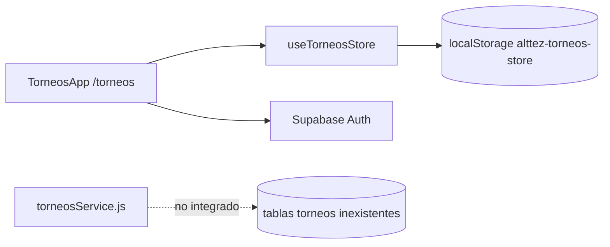
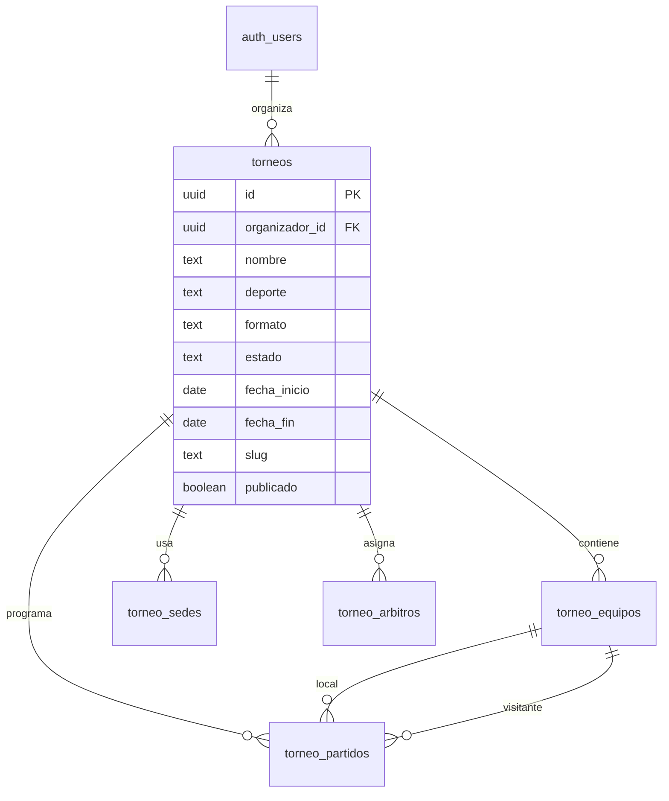
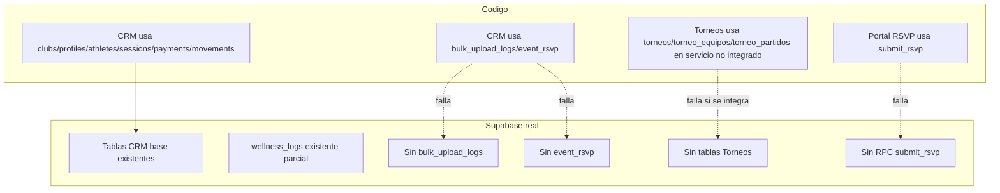

# Auditoria Supabase ALTTEZ

Fecha: 2026-05-06  
Fuente real: `docs/supabase-schema-actual.sql`  
Fuentes comparadas: `supabase/migrations/*`, `src/**/*`, `supabase/functions/*`, `docs/technical-audit.md`  
Alcance: solo lectura y documentacion. No se ejecuto ninguna migracion ni se modifico la base de datos.

## 1. Resumen ejecutivo

La base de datos real de Supabase no esta alineada con las migraciones del repositorio ni con todo el codigo actual.

Hallazgos principales:

- El schema real contiene 11 tablas: `athletes`, `clubs`, `health_snapshots`, `match_stats`, `movements`, `payments`, `profiles`, `sessions`, `tactical_data`, `user_sessions`, `wellness_logs`.
- Las migraciones versionan tablas adicionales que no existen en la base real: `services`, `journal_entries`, `bulk_upload_logs` y `event_rsvp`.
- El codigo usa tablas que no existen en la base real: `bulk_upload_logs`, `event_rsvp`, `torneos`, `torneo_equipos`, `torneo_partidos`.
- El codigo usa RPCs que no existen en la base real: `submit_rsvp` y `delete_user`.
- La base real no tiene ninguna tabla de Torneos. El modulo Torneos funciona hoy como estado local con Zustand/localStorage; su servicio Supabase apunta a tablas inexistentes.
- La base real parece tener aplicadas parcialmente las migraciones iniciales, `002_auth_profiles_rls.sql` y `008_wellness_logs.sql`, pero no refleja varias migraciones posteriores o intermedias.
- Hay deriva critica en seguridad y compatibilidad: `profiles_update_own` en la base real no refleja la restriccion de `006_fix_profiles_club_id_write.sql`; `wellness_logs.athlete_id` sigue como `text`; `sessions` no tiene `duracion_minutos`; `profiles` no tiene columnas de consentimiento.

Estado recomendado: congelar cambios de DB hasta crear un baseline versionado del schema real y luego generar migraciones incrementales verificadas para cerrar la brecha.

## 2. Tablas existentes en la base de datos real

Detectadas en `docs/supabase-schema-actual.sql`:

| Tabla real | Dominio | Estado |
|---|---|---|
| `clubs` | CRM | Existe con PK `id`, datos de club y `mode`. |
| `profiles` | Auth/CRM | Existe con `id`, `club_id`, `role`, `full_name`, `created_at`. |
| `athletes` | CRM | Existe, pero no tiene columnas de carga masiva versionadas en `004`. |
| `sessions` | CRM | Existe, pero no tiene `duracion_minutos` de `011`. |
| `payments` | CRM | Existe. |
| `movements` | CRM | Existe. |
| `match_stats` | CRM | Existe. |
| `health_snapshots` | CRM salud/RPE | Existe. |
| `tactical_data` | CRM tactica | Existe. |
| `user_sessions` | CRM/RBAC legado | Existe, pero uso actual bajo en codigo. |
| `wellness_logs` | CRM wellness | Existe, pero `athlete_id` sigue como `text` y no tiene FK a `athletes`. |

No existen en la base real:

- `services`
- `journal_entries`
- `bulk_upload_logs`
- `event_rsvp`
- `torneos`
- `torneo_equipos`
- `torneo_partidos`
- `torneo_sedes`
- `torneo_arbitros`
- `torneo_categorias`

## 3. Tablas versionadas en migraciones

Tablas declaradas por migraciones del repositorio:

| Tabla | Migracion | Existe en DB real | Observacion |
|---|---|---:|---|
| `clubs` | `001_initial_schema.sql` | Si | Base aplicada. |
| `athletes` | `001_initial_schema.sql` | Si | Parcial: faltan columnas de `004`. |
| `sessions` | `001_initial_schema.sql` | Si | Parcial: falta `duracion_minutos` de `011`. |
| `payments` | `001_initial_schema.sql` | Si | Alineada en lo principal. |
| `movements` | `001_initial_schema.sql` | Si | Alineada en lo principal. |
| `match_stats` | `001_initial_schema.sql` | Si | Alineada en lo principal. |
| `health_snapshots` | `001_initial_schema.sql` | Si | Alineada en lo principal. |
| `user_sessions` | `001_initial_schema.sql` | Si | Uso funcional incierto. |
| `tactical_data` | `001_initial_schema.sql` | Si | Alineada en lo principal. |
| `profiles` | `002_auth_profiles_rls.sql` | Si | Falta endurecimiento de `006` y columnas de `005`. |
| `services` | `003_portal_services_journal.sql` | No | Migracion no reflejada en DB real. |
| `journal_entries` | `003_portal_services_journal.sql` | No | Migracion no reflejada en DB real. |
| `bulk_upload_logs` | `004_bulk_upload_athletes.sql` | No | Codigo la usa; DB real no la tiene. |
| `event_rsvp` | `007_event_rsvp.sql` | No | Codigo la usa; DB real no la tiene. |
| `wellness_logs` | `008_wellness_logs.sql` | Si | Falta ajuste posterior de `012`. |

Cambios de columnas versionados pero ausentes en DB real:

| Cambio esperado | Migracion | Estado real |
|---|---|---|
| `athletes.apellido` | `004_bulk_upload_athletes.sql` | Ausente. |
| `athletes.numero_dorsal` | `004_bulk_upload_athletes.sql` | Ausente. |
| `athletes.documento_identidad` | `004_bulk_upload_athletes.sql` | Ausente. |
| `athletes.contacto_emergencia` | `004_bulk_upload_athletes.sql` | Ausente. |
| `athletes.updated_at` | `004_bulk_upload_athletes.sql` | Ausente. |
| `profiles.consent_at` | `005_fix_rls_consent.sql` | Ausente. |
| `profiles.consent_version` | `005_fix_rls_consent.sql` | Ausente. |
| `profiles.guardian_consent` | `005_fix_rls_consent.sql` | Ausente. |
| `sessions.duracion_minutos` | `011_sessions_duracion_minutos.sql` | Ausente. |
| `wellness_logs.athlete_id bigint` | `012_wellness_logs_athlete_fk.sql` | No aplicado; sigue `text`. |
| FK `wellness_logs.athlete_id -> athletes.id` | `012_wellness_logs_athlete_fk.sql` | Ausente. |

## 4. Tablas usadas en codigo

Referencias directas encontradas en `src`:

| Tabla/RPC | Archivo principal | Dominio | Existe en DB real |
|---|---|---|---:|
| `profiles` | `src/shared/services/authService.js`, `src/shared/services/supabaseService.js` | Auth/CRM | Si |
| `clubs` | `src/shared/services/supabaseService.js` | CRM | Si |
| `athletes` | `src/shared/services/supabaseService.js` | CRM | Si |
| `bulk_upload_logs` | `src/shared/services/supabaseService.js` | CRM carga masiva | No |
| `sessions` | `src/shared/services/supabaseService.js` | CRM entrenamiento | Si |
| `payments` | `src/shared/services/supabaseService.js` | CRM finanzas | Si |
| `movements` | `src/shared/services/supabaseService.js` | CRM finanzas | Si |
| `match_stats` | `src/shared/services/supabaseService.js` | CRM competencia | Si |
| `health_snapshots` | `src/shared/services/supabaseService.js` | CRM salud/RPE | Si |
| `tactical_data` | `src/shared/services/supabaseService.js` | CRM tactica | Si |
| `user_sessions` | `src/shared/services/supabaseService.js` | CRM/RBAC legado | Si |
| `event_rsvp` | `src/app/scheduling/EventPanel.jsx` | CRM calendario/RSVP | No |
| `torneos` | `src/app/torneos/services/torneosService.js` | Torneos | No |
| `torneo_equipos` | `src/app/torneos/services/torneosService.js` | Torneos | No |
| `torneo_partidos` | `src/app/torneos/services/torneosService.js` | Torneos | No |
| RPC `create_club_and_link_admin` | `src/shared/services/supabaseService.js` | CRM registro | Si |
| RPC `submit_rsvp` | `src/marketing/pages/ConfirmarAsistencia.jsx` | Portal publico RSVP | No |
| RPC `delete_user` | `src/shared/services/authService.js` | Auth/Torneos ajustes | No |

Notas:

- `src/app/torneos/TorneosApp.jsx` usa Supabase Auth (`supabase.auth.getUser`, `onAuthStateChange`) pero el estado de torneos se mantiene en `src/app/torneos/store/useTorneosStore.js`.
- `src/app/torneos/services/torneosService.js` existe, pero en la auditoria inicial no se encontraron imports desde las paginas/store de Torneos. Es una capa remota prevista, no integrada.
- `src/shared/types/wellnessTypes.js` documenta `wellness_logs`, pero no se encontraron llamadas directas `.from("wellness_logs")` desde el frontend.

## 5. Tablas usadas en codigo pero ausentes en migraciones

| Tabla | Uso en codigo | Existe en migraciones | Existe en DB real | Riesgo |
|---|---|---:|---:|---|
| `torneos` | CRUD en `torneosService.js` | No | No | Alto: servicio remoto no puede funcionar. |
| `torneo_equipos` | CRUD en `torneosService.js` | No | No | Alto: equipos de torneo no se pueden persistir. |
| `torneo_partidos` | CRUD/resultados en `torneosService.js` | No | No | Alto: fixtures/resultados no se pueden persistir. |

No hay migraciones versionadas para Torneos. Esto confirma que el modulo fue agregado en frontend antes de tener contrato de DB.

## 6. Tablas existentes en Supabase pero no usadas en codigo

| Tabla real | Uso directo encontrado | Evaluacion |
|---|---:|---|
| `wellness_logs` | No se encontro `.from("wellness_logs")` | Existe en DB y migraciones, pero no esta conectada como persistencia frontend. |
| `user_sessions` | Solo helper `createUserSession` en `supabaseService.js` | Tabla legacy/RBAC con bajo uso funcional visible. |

Tablas versionadas pero ausentes en DB y no usadas por el portal actual:

- `services`
- `journal_entries`

El portal actual parece apoyarse en datos locales como `src/marketing/data/portalData.js`, no en Supabase.

## 7. Tablas de Torneos detectadas o ausentes

No existe ninguna tabla real de Torneos en `docs/supabase-schema-actual.sql`.

Tablas referenciadas por codigo:

- `torneos`
- `torneo_equipos`
- `torneo_partidos`

Tablas probablemente necesarias segun el store actual:

- `torneos`: torneo base, propietario, estado, formato, fechas, slug, publicado.
- `torneo_equipos`: equipos por torneo, color, escudo, grupo.
- `torneo_partidos`: partidos por torneo, fase, ronda, equipos, goles, estado, fecha, lugar, orden.
- `torneo_sedes`: el store ya maneja `sedes`.
- `torneo_arbitros`: el store ya maneja `arbitros`.
- `torneo_categorias`: aparece navegacion conceptual de categorias en `TorneosApp.jsx`, pero no hay modelo persistente.

Diagrama de estado actual:

Arquitectura de DB recomendada para Torneos:

## 8. Estado de RLS

RLS habilitado en la base real:

- `athletes`
- `clubs`
- `health_snapshots`
- `match_stats`
- `movements`
- `payments`
- `profiles`
- `sessions`
- `tactical_data`
- `user_sessions`
- `wellness_logs`

Policies reales relevantes:

- CRM por club: `athletes_*_club`, `sessions_*_club`, `payments_*_club`, `movements_*_club`, `match_stats_*_club`, `health_snapshots_*_club`, `tactical_data_*_club`, `user_sessions_*_club`.
- Clubes: existen policies duplicadas/solapadas por origen:
  - `authenticated_insert_clubs`
  - `authenticated_select_own_club`
  - `admin_update_own_club`
  - `clubs_insert_authenticated`
  - `clubs_select_own`
  - `clubs_update_own`
- Profiles:
  - `profiles_select_own`
  - `profiles_update_own`
- Wellness:
  - `select_own_club_wellness`
  - `insert_own_club_wellness`
  - `admin_delete_wellness`

Diferencias RLS contra migraciones:

- `006_fix_profiles_club_id_write.sql` no esta reflejada. La policy real `profiles_update_own` permite actualizar el perfil propio solo con condicion `id = auth.uid()`, pero no conserva explicitamente `club_id` y `role`. Riesgo: si Supabase permite actualizar columnas sensibles desde cliente, un usuario podria intentar cambiar `club_id` o `role`.
- `005_fix_rls_consent.sql` no esta reflejada porque `bulk_upload_logs` no existe y las columnas de consentimiento tampoco.
- `007_event_rsvp.sql` y `010_rsvp_secure_rpc.sql` no estan reflejadas porque `event_rsvp` no existe.
- Hay grants amplios a `anon` sobre tablas, pero RLS esta habilitado. En Supabase esto no necesariamente implica acceso efectivo si no hay policies para `anon`, pero aumenta la necesidad de revisar permisos y policies con rigor.

## 9. Estado de funciones RPC

Funciones reales en DB:

| Funcion real | Usada por codigo | Migracion | Estado |
|---|---:|---|---|
| `create_club_and_link_admin` | Si | `001_fix_clubs_rls.sql` | Existe. |
| `get_my_club_id` | Indirecta en RLS | `002_auth_profiles_rls.sql` | Existe. |
| `handle_new_user` | Trigger Auth | `002_auth_profiles_rls.sql` | Existe. |

Funciones esperadas por codigo/migraciones pero ausentes:

| Funcion ausente | Usada por codigo | Migracion | Impacto |
|---|---:|---|---|
| `submit_rsvp` | Si, `ConfirmarAsistencia.jsx` | `010_rsvp_secure_rpc.sql` | RSVP publico falla. |
| `delete_user` | Si, `authService.js` | `013_delete_user_rpc.sql` | Eliminar cuenta falla. |
| `set_updated_at` | No actualmente | `003_portal_services_journal.sql` | Ausente porque portal DB no existe. |
| `update_updated_at_column` | No directamente | `004_bulk_upload_athletes.sql` | Ausente con columnas bulk. |

## 10. Diferencias entre base real y migraciones

Deriva por migracion:

| Migracion | Estado frente a DB real |
|---|---|
| `001_initial_schema.sql` | Mayormente aplicada. |
| `001_fix_clubs_rls.sql` | Parcial/aplicada: se ven policies y RPC `create_club_and_link_admin`. |
| `002_auth_profiles_rls.sql` | Mayormente aplicada. |
| `003_portal_services_journal.sql` | No aplicada en DB real. |
| `004_bulk_upload_athletes.sql` | No aplicada o revertida: faltan columnas `athletes.*`, tabla `bulk_upload_logs` y trigger. |
| `005_fix_rls_consent.sql` | No aplicada: faltan columnas de consentimiento y policies de bulk logs. |
| `006_fix_profiles_club_id_write.sql` | No reflejada: policy real no conserva `club_id` y `role`. |
| `007_event_rsvp.sql` | No aplicada: falta `event_rsvp`. |
| `008_wellness_logs.sql` | Aplicada. |
| `009_rebrand_alttez.sql` | No aplicable/no reflejada: faltan `services` y `journal_entries`. |
| `010_rsvp_secure_rpc.sql` | No aplicada: falta `submit_rsvp` y falta tabla base `event_rsvp`. |
| `011_sessions_duracion_minutos.sql` | No aplicada: falta `sessions.duracion_minutos`. |
| `012_wellness_logs_athlete_fk.sql` | No aplicada: `wellness_logs.athlete_id` sigue `text` y no hay FK. |
| `013_delete_user_rpc.sql` | No aplicada: falta `delete_user`. |

Riesgo adicional: hay dos archivos con prefijo `001_`. Aunque Git/Supabase los ordena alfabeticamente, esta numeracion puede inducir errores humanos y dificulta saber que fue aplicado realmente.

## 11. Diferencias entre base real y codigo

CRM:

- `bulkInsertAthletes` en `src/shared/services/supabaseService.js` inserta en `bulk_upload_logs`, pero la tabla no existe. La carga masiva puede insertar atletas y luego fallar al registrar logs, o fallar segun camino de ejecucion.
- `EventPanel.jsx` lee/escribe `event_rsvp`, pero la tabla no existe. El calendario con RSVP no puede persistir confirmaciones.
- `ConfirmarAsistencia.jsx` llama `submit_rsvp`, pero la RPC no existe. El link publico de confirmacion falla.
- `authService.deleteAccount()` llama `delete_user`, pero la RPC no existe. La eliminacion de cuenta falla.
- `sessions.duracion_minutos` es esperada por la evolucion de RPE, pero no existe en DB real.
- `wellness_logs` existe, pero no esta conectado por codigo y su tipo `athlete_id` no coincide con `athletes.id`.

Torneos:

- `torneosService.js` no puede operar contra la base real porque sus tres tablas no existen.
- No hay RLS ni tenant model para Torneos.
- No hay RPC ni politicas publicas para vista por `slug`.

Marketing/portal:

- Las migraciones versionan `services` y `journal_entries`, pero la base real no las tiene.
- El portal actual no parece depender de esas tablas, por lo que no hay falla inmediata, pero si existe deuda de modelo/documentacion.

## 12. Riesgos actuales para el modulo de Torneos

1. Persistencia remota inexistente.
   - Las tablas de Torneos no existen en DB real ni en migraciones.
   - Si se integra `torneosService.js`, fallara en runtime.

2. Sin multi-tenancy definido.
   - El comentario de `torneosService.js` dice que usa `organizador_id`, pero el `upsert` de `saveTorneo` no lo escribe.
   - No hay RLS para aislar torneos por organizador.

3. Sin contrato de datos.
   - El store maneja `sedes`, `arbitros`, `wizardDraft`, `schedulingConfig`, `publicado`, `slug`, grupos y partidos.
   - El servicio remoto solo modela parcialmente `torneos`, `torneo_equipos`, `torneo_partidos`.

4. Riesgo comercial.
   - El modulo fue creado para un posible cliente, pero actualmente no tiene persistencia confiable multiusuario.
   - Los datos en localStorage se pierden por navegador/dispositivo y no sirven para colaboracion.

5. Seguridad futura no definida.
   - Una vista publica de torneos por `slug` requiere policies de SELECT anon muy acotadas.
   - La administracion requiere policies authenticated por `organizador_id` u organizacion.

## 13. Recomendaciones para versionar correctamente la base de datos

1. Crear un baseline del estado real.
   - Guardar `docs/supabase-schema-actual.sql` como evidencia.
   - Crear una migracion baseline que represente exactamente el estado real, o marcar historicamente las migraciones ya divergentes y crear una nueva secuencia limpia desde el estado real.

2. No ejecutar migraciones antiguas a ciegas.
   - Varias migraciones asumen tablas que no existen (`005` asume `bulk_upload_logs`, `010` asume `event_rsvp`).
   - Debe construirse un plan incremental validado en staging.

3. Corregir numeracion.
   - Evitar dos `001_*`.
   - Usar timestamps o secuencia unica: `20260506_001_baseline_real.sql`, `20260506_002_add_torneos.sql`, etc.

4. Separar migraciones por dominio.
   - CRM: clubs, profiles, athletes, sessions, payments, movements, health, tactical.
   - Torneos: torneos, equipos, partidos, sedes, arbitros.
   - Marketing: services, journal_entries si se decide usar DB.

5. Definir estrategia de drift.
   - Mantener un comando de comparacion schema real vs migraciones.
   - Hacer obligatorio revisar drift antes de deploy.
   - Usar `scripts/check-schema-drift.js` como base, pero ampliarlo para columnas, policies y RPCs, no solo tablas.

6. Versionar Torneos antes de integrarlo a Supabase.
   - Crear migracion formal con tablas, indices, constraints, RLS y seeds minimos.
   - Ajustar `torneosService.js` para escribir `organizador_id`.
   - Definir migracion localStorage -> Supabase si ya hay datos piloto.

7. Cerrar brechas de seguridad existentes.
   - Reaplicar de forma controlada el endurecimiento de `profiles_update_own`.
   - Revisar grants a `anon`.
   - Definir si `delete_user` debe existir y con que controles.
   - Restaurar `submit_rsvp` solo despues de crear `event_rsvp` con RLS segura.

## 14. Proximos pasos

Orden recomendado:

1. Crear un ambiente staging o una base temporal desde el schema real.
2. Generar una migracion de reconciliacion que no destruya datos:
   - agregar columnas faltantes si se confirman necesarias;
   - crear tablas faltantes usadas por codigo (`event_rsvp`, `bulk_upload_logs`) o desactivar temporalmente features que las usan;
   - crear RPCs faltantes (`submit_rsvp`, `delete_user`) solo si el producto las requiere.
3. Diseñar el modelo de Torneos:
   - `organizador_id`;
   - tablas base;
   - RLS;
   - policies publicas por `slug` y `publicado`.
4. Actualizar `torneosService.js` para coincidir con el schema versionado.
5. Decidir el futuro de `services` y `journal_entries`:
   - si marketing seguira estatico, quitar esas tablas de la hoja de ruta;
   - si marketing sera administrable, aplicar migraciones y conectar el portal.
6. Actualizar `docs/technical-audit.md` y `docs/repo-structure.md` con el resultado final de DB.
7. Agregar una tarea recurrente de drift check antes de cada release.

## 15. Vista global de alineacion

